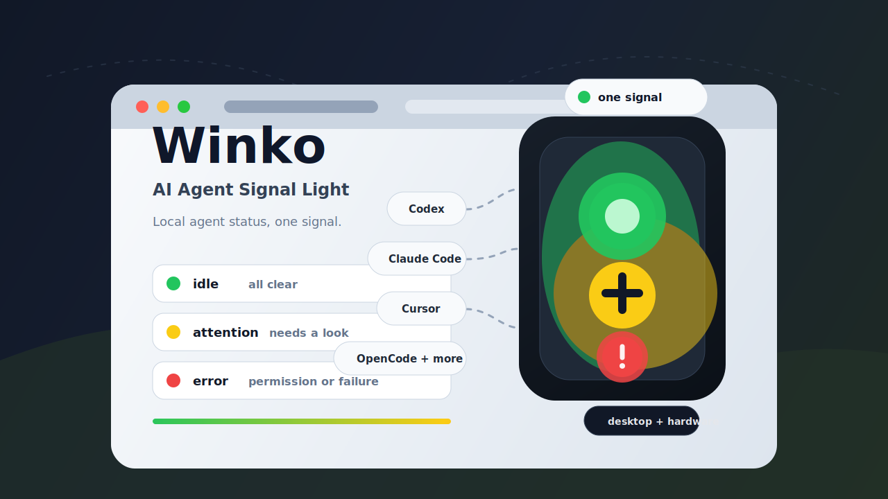

<p align="center">
  
</p>

<h1 align="center">Winko</h1>

<p align="center">
  <strong>Turn your AI agents' quiet work into a small, expressive signal light.</strong>
</p>

<p align="center">
  <a href="README.md">中文</a>
  ·
  <a href="https://github.com/zhc93design/winko/releases">Download</a>
  ·
  <a href="#quick-start">Quick Start</a>
  ·
  <a href="#signal-language">Signal Language</a>
  ·
  <a href="#development">Development</a>
</p>

<p align="center">
  <a href="https://github.com/zhc93design/winko/releases">
    
  </a>
  
  
</p>



## What It Is

Winko is a macOS desktop signal light for people who work with multiple AI coding agents. It watches CatDesk, Claude Code, Codex, Cursor, OpenClaw, Z Code, and OpenCode, then turns events scattered across terminals, editors, hooks, logs, and local status streams into one glanceable signal.

You do not need to keep checking every agent to know whether it is still running, waiting for a plan confirmation, blocked on permission, or already failed. Winko sits quietly at the edge of your screen: green when everything is calm, yellow when your attention would help, and red when something needs a decision.

It is not another dashboard to babysit. It is an ambient object for your peripheral vision, keeping the state of your agent queue visible without pulling you out of your work.

## Why Winko

AI agent work often happens in the background: the model is thinking, tools are running, hooks are waiting, and another editor may still be moving. With one tool you can switch back and check. With several agents running together, it becomes hard to know who needs you now.

Winko keeps that loop smaller:

- Merge multiple agent sources into one shared signal.
- Separate working, attention, permission, and error states by urgency.
- Preserve the most recent completed session briefly, so clicking the light can take you back to the source most likely to need follow-up.
- Run as a floating desktop light or bridge the same signal to a CH552 physical desk light.

## Main Features

| Feature | Details |
| --- | --- |
| Multi-source monitoring | CatDesk, Claude Code, Codex, Cursor, OpenClaw, Z Code, and OpenCode. |
| Layered signal language | Raw events become stages, stages become signals, and signals become visual lamp effects. |
| Multi-session aggregation | When several sessions run at once, Winko shows the highest-priority state. |
| Claude Code permission popup | Claude Code questions, plan confirmations, and permission requests can be presented by Winko. |
| Flexible visual modes | Triple light, single color light, single mono light, dual red/green light, and CH552 hardware bridge. |
| Local privacy boundary | Uses local hooks, logs, files, or status streams; read-only integrations avoid prompt and model message bodies. |

## Signal Language

Winko keeps the model layered:

```text
software event -> work stage -> signal state -> visible lamp effect
```

That means you can tune how the lamp looks without changing how agent events are interpreted.

| Signal | Meaning | Default feel |
| --- | --- | --- |
| `idle` | Nothing active, completed, all clear | Green solid |
| `working` | Thinking, running tools, or editing | Quiet/off by default |
| `attention` | User input or a quick look may help | Yellow or red flash, depending on style |
| `error` | Permission, plan confirmation, failure, or blockage | Strong alert |
| `silent` | Muted or manually quieted | Off |

## Supported Sources

| Source | How Winko Listens | Boundary |
| --- | --- | --- |
| CatDesk | `agent.log` watcher and session polling | Reads status events and session list. |
| Claude Code | Local hook server | Supports status monitoring and the Claude Code permission popup. |
| Codex | Local hook server | Watches hook events; plan turns can remind you to continue. |
| Cursor | Local hook server | Status observation only; native approval UI stays in Cursor. |
| OpenClaw | Read-only session file adapter | No hook installation and no approval takeover. |
| Z Code | Read-only JSONL log watcher | Does not read message bodies or guess unobservable permission states. |
| OpenCode | Server SSE with structured log fallback | Uses structured status fields, not message text. |

## Visual Modes

The same signal can be rendered through several lamp styles:

- Triple red/yellow/green light
- Single color-changing light
- Single mono light for minimal hardware
- Dual red/green light, horizontal or vertical
- CH552 USB hardware signal bridge

## Quick Start

Download the latest macOS release from [zhc93design/winko releases](https://github.com/zhc93design/winko/releases), open Winko, and follow the onboarding flow to install local hooks.

Codex users may need to run `/hooks` once and trust the hook when Codex first discovers it.

Runtime configuration lives at:

```text
~/.catdesk-signal-light/config.json
```

## Privacy Shape

Winko is a local status translator. It watches local hooks, local logs, local session files, or local status streams, and it does not send those states to an external service.

For read-only integrations such as OpenClaw, Z Code, and OpenCode log fallback, Winko uses structured status metadata for signal decisions and avoids reading prompts, model output, or full message bodies.

## Development

```bash
npm install
npm test
npm start
```

The app runs as an Electron desktop app. In development mode, online update checks are skipped.

## Build

```bash
npm run pack
npm run dist
```

`npm run pack` builds an unpacked Universal macOS app in `dist/mac-universal/`.

`npm run dist` builds the signed, notarized release DMG and runs post-build verification. Before running it, set the local-only Apple notarization environment variables described in [`docs/macos-signing.md`](docs/macos-signing.md). The API key file must never be placed in this repository.

Expected release artifacts:

```text
dist/Winko-X.Y.Z-universal.dmg
dist/Winko-X.Y.Z-universal.dmg.blockmap
dist/latest-mac.yml
```

## Repository Map

| Path | Purpose |
| --- | --- |
| `src/` | Electron main process, renderers, hook server, signal aggregation, updater, and hardware bridge. |
| `hardware/` | CH552 hardware sketches, wiring, and firmware notes. |
| `tests/` | Vitest unit tests for the desktop app. |
| `scripts/` | Hook scripts, release checks, build verification, and developer helpers. |
| `docs/` | Design notes, integration research, and generated monitoring maps. |
| `assets/` | App icons and README visuals. |

## Release Notes

Before release, these must match:

```text
package.json version = X.Y.Z
src/renderer/settings.html about-version-badge = vX.Y.Z
src/renderer/settings.html changelog top entry = vX.Y.Z
dist/latest-mac.yml version = X.Y.Z
```

Check source-side consistency:

```bash
npm run release:check -- X.Y.Z
```

Build and check artifact-side consistency:

```bash
npm run dist
npm run release:check -- X.Y.Z --after-dist
```

The release helper can run tests, build, commit, push, create the public GitHub Release, and upload the three required assets:

```bash
npm run release:github -- X.Y.Z
```

For public distribution, packaged builds check `zhc93design/winko` for updates; development mode still skips online update checks.

## Maintainer Notes

Read `SOURCE_OF_TRUTH.md` before changing project rules or documentation. Read `AGENTS.md` before changing `src/`, `scripts/`, config shape, event mappings, release flow, or tests.

`docs/AI_CONTEXT.generated.md` is the generated working index for AI agents. Regenerate it with `npm run ai-context:update` when source registry, IPC, scripts, tests, default config, renderer files, or guardrail scope changes. Do not edit it by hand.
