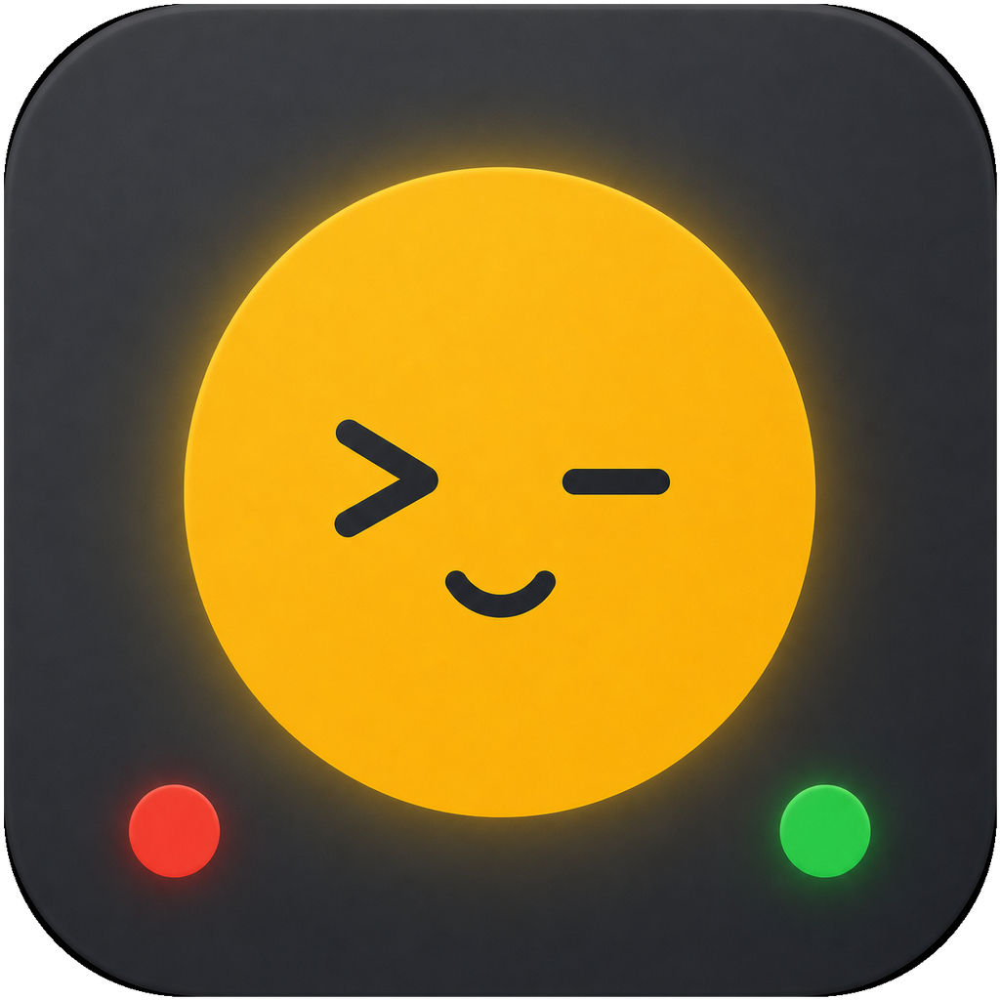
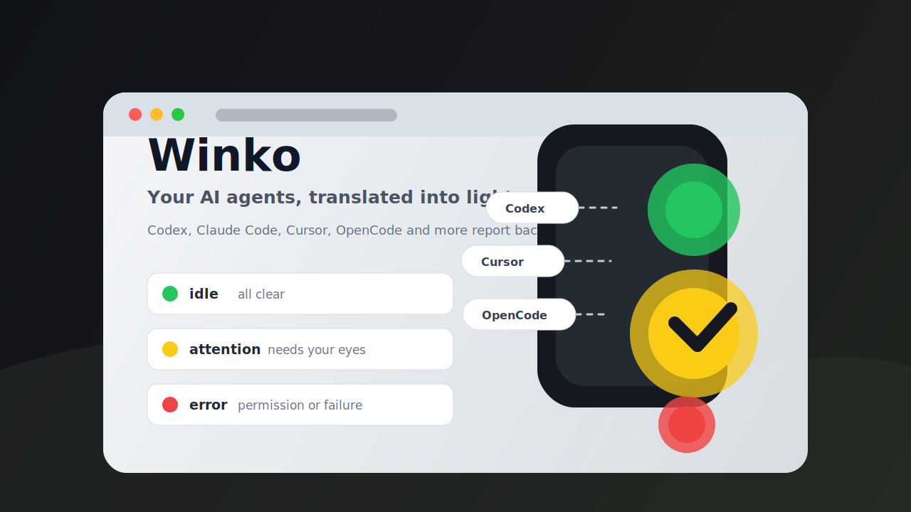

  

<h1 align="center">Blinko</h1>

  <strong>把 AI Agent 的沉默，翻译成一盏会呼吸的灯。</strong> 
  <strong>Turn your AI agents' quiet work into a small, expressive signal light.</strong>

  <a href="https://github.com/zhc93design/blinko/releases/latest">Download</a>
  ·
  <a href="https://zhc93design.github.io/blinko/">Homepage</a>
  ·
  <a href="#signal-language--灯语">Signal Language</a>
  ·
  <a href="#privacy-shape--隐私边界">Privacy</a>

## What It Feels Like / 它是什么

Blinko is a macOS desktop companion for people who work with multiple AI coding agents. It watches CatDesk, Claude Code, Codex, Cursor, OpenClaw, Z Code, and OpenCode, then turns scattered events into one glanceable signal: green when everything is calm, yellow when your attention would help, red when something needs a decision or went wrong.

Blinko 是一个 macOS 桌面悬浮信号灯，给同时使用多个 AI 编程助手的人一点“桌面陪伴感”。它会监听 CatDesk、Claude Code、Codex、Cursor、OpenClaw、Z Code 和 OpenCode，把分散在终端、编辑器和日志里的状态，变成一眼能读懂的灯语：绿色表示安心，黄色表示值得看一眼，红色表示需要你做决定或处理异常。

It is not another dashboard to babysit. It is a tiny ambient object that lets your peripheral vision know whether your agents are flowing, waiting, or stuck.

它不是又一个需要盯着看的面板，而是一个安静的环境提示物：让余光知道 Agent 正在推进、等你回应，还是卡住了。

## Download / 下载

Download the latest signed and notarized macOS DMG from:

从这里下载最新版已签名、公证的 macOS DMG：

https://github.com/zhc93design/blinko/releases/latest

Blinko uses this public repository as its download and update channel. The app checks public GitHub Releases for update metadata.

Blinko 使用这个公开仓库作为下载和更新通道。App 会从公开 GitHub Releases 检查更新信息。

## Signal Language / 灯语

| Signal | 中文含义 | English meaning | Default feel |
| --- | --- | --- | --- |
| `idle` | 空闲、完成、可以放心 | Nothing active, all clear | Green solid |
| `working` | 正在思考、执行工具或编辑 | Thinking, running tools, or editing | Quiet/off by default |
| `attention` | 可能需要看一眼或补充输入 | Needs a look or user input | Yellow/red flash, by style |
| `error` | 权限、计划确认、失败或阻塞 | Permission, confirmation, failure, or blockage | Strong red signal |
| `silent` | 手动关闭或静默 | Muted/off state | Off |

Blinko keeps the signal model layered: raw events become stages, stages become signals, and signals become concrete light effects. That means users can tune the visible lamp language without changing how agent events are interpreted.

Blinko 的状态模型是分层的：原始事件先变成工作阶段，工作阶段再变成信号状态，最后才渲染为具体灯效。因此你可以调整“灯怎么亮”，而不破坏“事件怎么判断”。

## Supported Sources / 支持的数据源

| Source | How Blinko listens | 中文说明 |
| --- | --- | --- |
| CatDesk | `agent.log` watcher and session polling | 监听日志与会话列表 |
| Claude Code | Local hook server | 支持状态监控与 Claude Code 权限弹窗 |
| Codex | Local hook server | 监听 Hook 事件，计划回合会提示继续输入 |
| Cursor | Local hook server | 只做状态观察，不接管原生审批 |
| OpenClaw | Read-only session file adapter | 只读会话文件，不接管审批 |
| Z Code | Read-only JSONL log watcher | 只读 CLI 日志，不读取正文 |
| OpenCode | Server SSE, with structured log fallback | 优先 SSE，必要时读取结构化状态日志 |

## Visual Modes / 显示形态

Blinko can render the same signal in several styles so it can fit your desk, your screen corner, or a physical light.

Blinko 支持多种灯具形态，同一套状态可以适配屏幕角落、桌面习惯或物理硬件。

| Mode | 中文 |
| --- | --- |
| Triple light | 三灯泡红黄绿信号灯 |
| Single color light | 单灯泡变色 |
| Single mono light | 单灯单色，适合极简硬件 |
| Dual light | 红绿双灯，支持横排和竖排 |
| CH552 hardware bridge | 可接入自有 CH552 USB 硬件灯 |

## Privacy Shape / 隐私边界

Blinko is designed as a local status translator. It watches local hooks, local logs, local files, or local server status streams. For read-only integrations such as OpenClaw, Z Code, and OpenCode fallback logs, it uses structured status metadata and avoids reading prompt or model message bodies for signal decisions.

Blinko 的定位是本地状态翻译器。它监听的是本地 Hook、本地日志、本地会话文件或本机状态流。对于 OpenClaw、Z Code、OpenCode 日志降级等只读集成，Blinko 使用结构化状态元数据判断灯态，避免读取 prompt 或模型正文。
